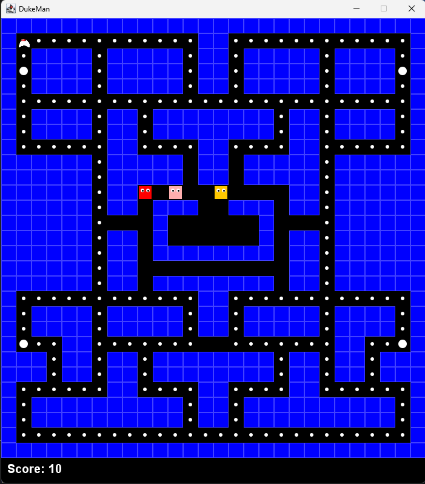

# DukeMan
DukeMan is a simple PacMan-style game written using plain Java and Swing.

This repository is a demonstration for the beginners over in the TogetherJava community on how they *could* use Java Swing
to make basic games.

## Screenshot
